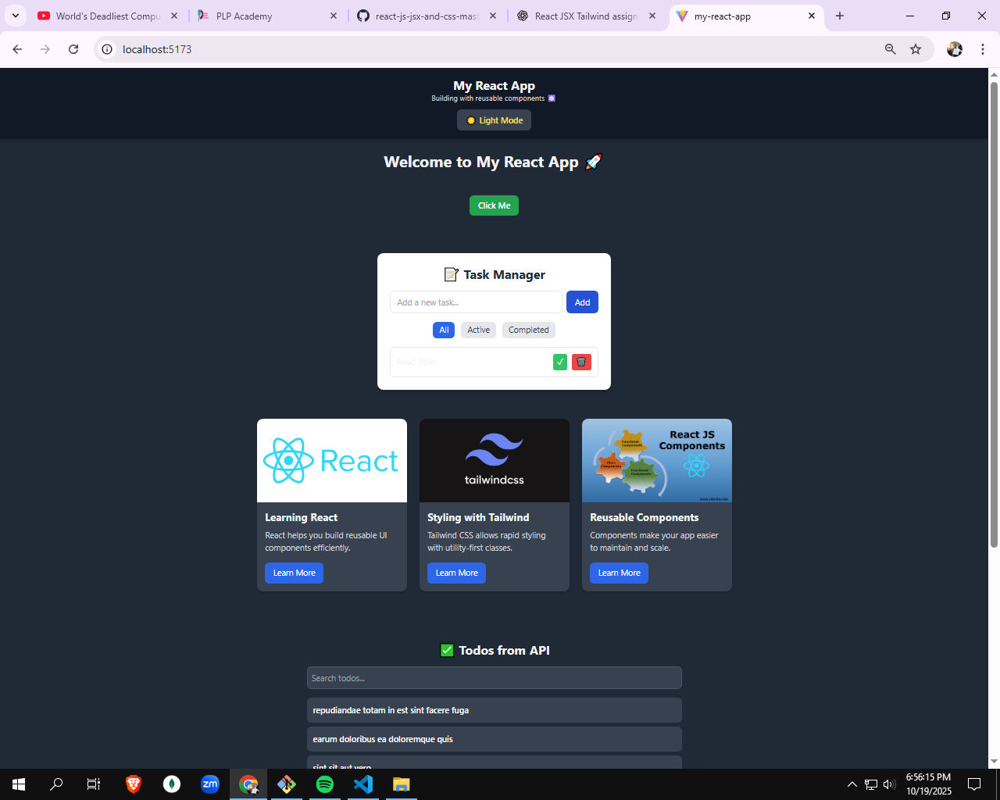
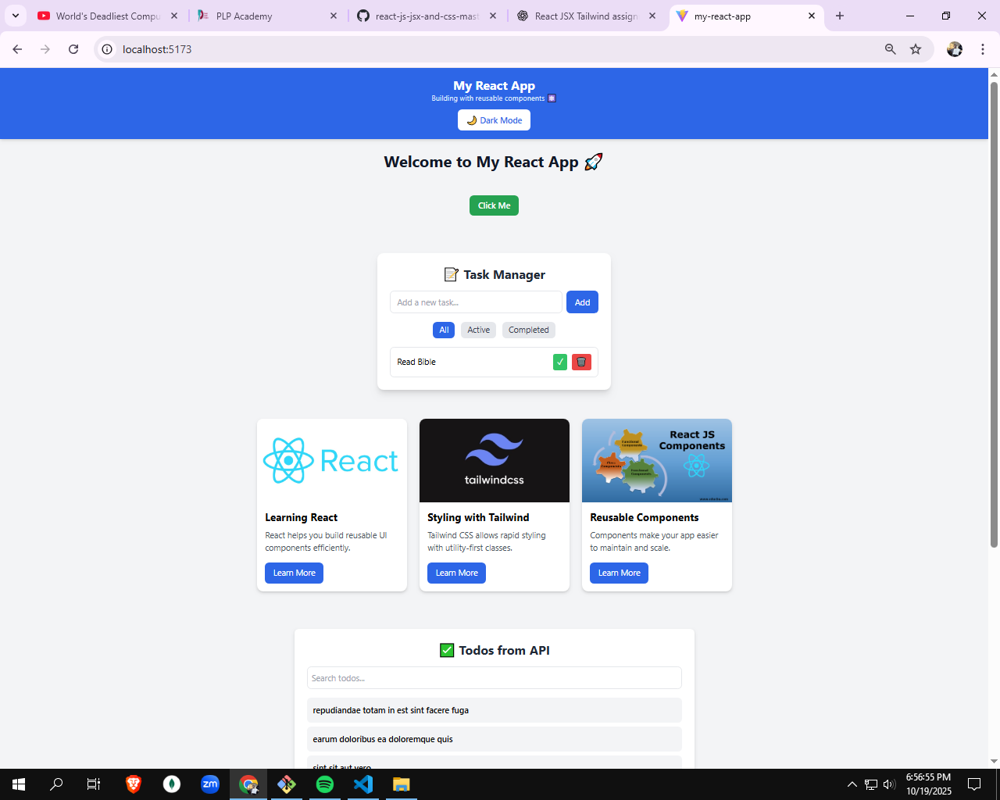

# My React App

Small Vite + React starter demonstrating Tailwind CSS, a theme provider, a reusable localStorage hook, a simple Task Manager (CRUD-ish) persisted to localStorage, and fetching paginated todos from an external API.

---

## Quick start

```markdown
# install
npm install

# start dev server
npm run dev
```

Then

Open http://localhost:5173

---
## What’s included (files & key symbols)

Core config
- [vite.config.js](vite.config.js)
- [tailwind.config.js](tailwind.config.js)
- [postcss.config.js](postcss.config.js)
- [eslint.config.js](eslint.config.js)
- [index.html](index.html)
- [package.json](package.json)

App entry & styles
- [src/main.jsx](src/main.jsx) — app root and provider mount
- [src/index.css](src/index.css)
- [src/App.jsx](src/App.jsx)

Theme & persistence
- [`ThemeContext.ThemeProvider`](src/context/ThemeContext.jsx) and [`ThemeContext.useTheme`](src/context/ThemeContext.jsx) implemented in [src/context/ThemeContext.jsx](src/context/ThemeContext.jsx)
- [`useLocalStorage`](src/hooks/useLocalStorage.js) hook implemented in [src/hooks/useLocalStorage.js](src/hooks/useLocalStorage.js)

UI components (in [src/components/](src/components/))
- [`Header`](src/components/Header.jsx)
- [`Footer`](src/components/Footer.jsx)
- [`Button`](src/components/Button.jsx)
- [`Card`](src/components/Card.jsx)

Feature components
- [`TaskManager`](src/components/TaskManager.jsx)
- [`ApiData`](src/components/ApiData.jsx)

Other project files
- [src/App.css](src/App.css)
- [src/assets/](src/assets/) (images referenced by components)
- [assets/](assets/) (project-root assets / screenshots)
- [public/](public/)

---

## Features & notes

- Theme toggling:
  - ThemeProvider toggles dark mode by applying the `dark` class to the root html element and persists the choice to localStorage.
- Persistent tasks:
  - `useLocalStorage` backs `TaskManager` so tasks persist across reloads.
- API data:
  - `ApiData` fetches todos from jsonplaceholder, implements search and simple pagination (10 items per page).
- Tailwind:
  - Configured via [tailwind.config.js](tailwind.config.js) with `darkMode: 'class'`.

---

## Screenshots / Evidence

The project-root screenshots live in the `assets/` folder. GitHub will render images referenced with relative paths. Replace the filenames below to match the actual files in your `assets/` folder.

Example embeds below:




If you are not sure file names, list the assets folder in a terminal (Windows):

```powershell
dir .\assets\
```

Or update these lines with the exact filenames found in that folder.

---

## Quick file map (click to open)
- [vite.config.js](vite.config.js)
- [tailwind.config.js](tailwind.config.js)
- [postcss.config.js](postcss.config.js)
- [eslint.config.js](eslint.config.js)
- [index.html](index.html)
- [package.json](package.json)
- [src/main.jsx](src/main.jsx)
- [src/index.css](src/index.css)
- [src/App.jsx](src/App.jsx)
- [src/context/ThemeContext.jsx](src/context/ThemeContext.jsx)
- [src/hooks/useLocalStorage.js](src/hooks/useLocalStorage.js)
- [src/components/Header.jsx](src/components/Header.jsx)
- [src/components/Footer.jsx](src/components/Footer.jsx)
- [src/components/Button.jsx](src/components/Button.jsx)
- [src/components/Card.jsx](src/components/Card.jsx)
- [src/components/TaskManager.jsx](src/components/TaskManager.jsx)
- [src/components/ApiData.jsx](src/components/ApiData.jsx)
- [assets/](assets/) (project screenshots)
- [src/assets/](src/assets/) (component images)

---
The site is live at: https://week3mern.netlify.app/